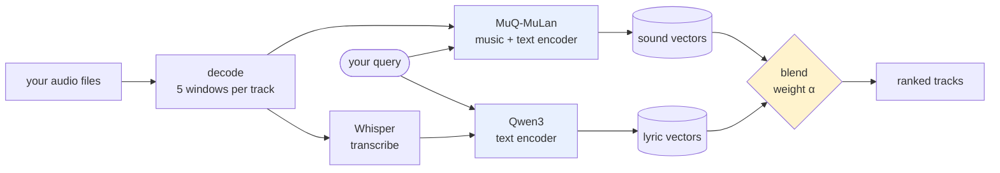

# aux

[](https://github.com/hgn2108/aux/actions/workflows/tests.yml)
[](pyproject.toml)
[](LICENSE)

**A Spotify-style recommender for the music you already own.**

Streaming services recommend well because they watch millions of listeners. If your music
sits in a folder on your laptop, none of that applies: local players search filenames and
genre tags, and nothing lets you ask for *"something quiet and bittersweet"* or *"like this,
but dreamier"*.

`aux` builds that recommender from the audio itself — no tags, no play counts, no listening
history.

**[▶ Try the live demo](https://aux-339224224982.us-central1.run.app)** · first load takes a
minute while the model starts


---

## How it works



Two independent signals, searched the same way:

- **Sound** — [MuQ-MuLan](https://huggingface.co/OpenMuQ/MuQ-MuLan-large) puts music and text
  in one embedding space, so a written description can be matched against a recording
  directly. Chosen over CLAP by a paired test on this corpus (p = 4.5e-08).
- **Lyrics** — Whisper transcribes the track, Qwen3 embeds the words.

A slider blends the two. Which setting is right turns out to depend on the question, which is
the main finding below.

## Run it

```bash
git clone https://github.com/hgn2108/aux && cd aux
pip install -e ".[app]"
streamlit run app.py
```

Point it at your own folder by dropping files into `data/music/`, or use the **Your music**
tab to upload them straight into the browser.

---

## Results

Relevance comes from facts rather than opinion: two tracks count as a match if they share a
genre, artist or album. None of those *is* musical similarity, so all three are reported —
they fail in different directions. Every score is **NDCG@10** (*of the ten tracks shown, how
many were right, and were the right ones near the top?*) against a computed random baseline.

### Recommending from sound alone

Given a track, about 6 of the 10 returned share its genre, against about 1 of 10 by chance.
Artist is a far harder target, and it does 56× better than chance there.

| relevance label | queries | NDCG@10 | random | lift |
|---|---:|---:|---:|---:|
| genre | 1,998 | 0.608 | 0.125 | **4.9×** |
| genre, same-artist pairs excluded | 1,998 | 0.566 | 0.123 | **4.6×** |
| artist | 1,324 | 0.311 | 0.006 | **56×** |
| album | 1,193 | 0.287 | 0.003 | **88×** |

Row two is a control: tracks from one album share production and mastering, so a system can
score on *genre* by recognising an *album* instead. Removing same-artist pairs costs 0.04, so
the genre result is not that effect in disguise.

### The right blend depends on the question

The same two systems, the same music, opposite answers — decided only by what was asked.

| α (weight on sound) | *"tracks like this one"* | *"songs about heartbreak"* |
|---:|---:|---:|
| 0.00 — lyrics only | 0.555 | **0.734** |
| 0.50 | 0.802 | 0.671 |
| 1.00 — sound only | **0.832** | 0.367 |

Genre and artist are things you can *hear*, so lyrics add nothing there. Ask what a song is
*about* and the lyric channel doubles the sound channel, winning 8 of 9 themes — the
exception being *heartbreak*, where sad songs sound sad.

Using the wrong setting costs **a third to a half** of the system's accuracy. There is no
correct fixed weight.

### Choosing the weight automatically does not work yet

Three routers were built to detect the question type and set the weight: keyword rules,
embedding similarity, and an LLM. Each was scored end to end against an *oracle* allowed to
see the answers, which caps what any router could be worth.

| router | NDCG@10 | vs fixed weight | ms/query |
|---|---:|---:|---:|
| *best fixed weight (no routing)* | *0.552* | — | *0.0* |
| keyword rules | 0.500 | −0.053 | 0.0 |
| embedding prototypes | 0.570 | +0.017 | 2.3 |
| LLM (Haiku) | 0.571 | +0.019 | 1686 |
| *oracle (ceiling)* | *0.670* | *+0.118* | — |

None beat a fixed weight significantly (n=96, paired permutation). **So the app exposes the
control instead of guessing** — the person searching already knows whether they are asking
about sound or meaning.

The keyword router first appeared to win at +0.058, on 24 queries written by the same person
who wrote its rules. Rerun on paraphrases that avoid those phrasings, it fell to −0.053:
best arm to worst. The original result was overfitting to the test set.


Full tables, ablations and significance tests: **[EVALUATION.md](EVALUATION.md)**.

---

## What's next

The system currently ranks by content alone, which is the right place to start and the wrong
place to stop. A recommender improves by observing what actually gets played.

1. **Behavioural personalization.** The app already plays results in place, so a play, a skip
   or a replay can be attributed to the query and rank that produced it. That gives
   first-party feedback without needing anyone's streaming history.
2. **Intent-specific preference.** The finding above says a listener's intent changes which
   signal matters; the same should hold for their taste. Preference learned on *"for running"*
   should not leak into *"for studying"*.
3. **Relevance against discovery.** Content similarity converges on the familiar. Measuring
   novelty as an explicit trade-off comes after preference exists to trade against.

---

## Limitations

- **Relevance labels are proxies.** Genre, artist and album are not musical similarity. They
  are used because they are objective and complete, and reported together because they fail
  differently.
- **The lyric results use a 160-track personal library.** No public corpus available here has
  a usable lyric channel: 56% of a sampled 75 Free Music Archive clips are instrumental, with
  transcripts running a median of 11 words.
- **Theme labels are model-generated**, validated against blind human judgement at Cohen's
  **κ = 0.60**. Dropping the two themes below that bar narrows the lyric lead from 0.734 to
  0.717 against 0.430 — the conclusion holds.
- **The router comparison uses 96 queries.** It rules out large effects, not small ones.
- **No learned fusion and no ANN index.** At this corpus size exact search is instant, and a
  learned combiner would be fitted on the same proxy labels whose weakness is the point.

## Layout

| path | what |
|---|---|
| `app.py` | the demo |
| `src/aux/ingest/` | probe, decode, content hashing, failure taxonomy |
| `src/aux/encode/` | encoder adapters, segmentation, pooling |
| `src/aux/lyrics/` | transcription and lyric embedding |
| `src/aux/recommend.py` | scoring, blending, explanations |
| `src/aux/route/` | the three fusion-weight routers |
| `src/aux/eval/` | ranking metrics, paired significance tests |
| `scripts/` | every experiment, one file each |
| `results/` | committed JSON behind every number above |

## Licence

MIT, for the code. The model weights downloaded at runtime carry their own licences
(MuQ-MuLan is CC-BY-NC). No music is distributed here — see [LICENSE](LICENSE).
