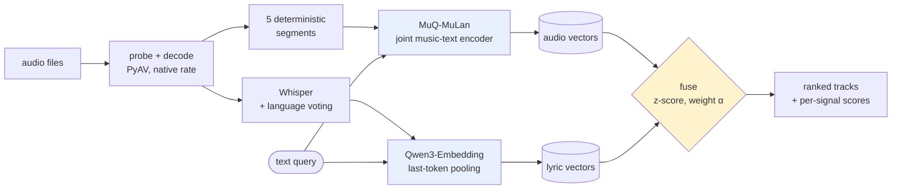

# aux

**Music recommendation from audio alone — and an evaluation that says when to trust it.**

Search and recommend music by how it **sounds**, by what the lyrics are **about**, or by
both. No genre tags, no play counts, no collaborative filtering: everything is computed from
the audio files themselves.

The interesting result is not the recommender. It is that **combining the two signals loses
on the task everyone benchmarks and wins by 2× on the task nobody does** — and most of this
repository is the work of establishing which is which.

```bash
pip install -e ".[app]"
streamlit run app.py
```

---

## What you can do with it

| | |
|---|---|
| **Search by description** | Type *"fast aggressive drums with distorted guitars"* and get back a black-metal band. Text and audio share one embedding space, so the query is matched against the recording, not against tags. |
| **Find similar tracks** | Pick any track; everything else is ranked against it. |
| **Choose the signal** | Sound, lyrics, or a weighted blend with the weight exposed as a slider. The blend is a control rather than a prediction, for a measured reason — see [the router result](#3-routing-the-decision-is-worth-making-the-routers-are-not). |
| **Bring your own music** | Upload files and they become a searchable library of their own, encoded live through the same pipeline the indexed corpora went through. Optionally transcribed too, at about 9s a track. |
| **Read the evidence** | A Findings tab with every table, baseline, significance test and limitation, read from committed results files so nothing can drift from the run that produced it. |

Two corpora ship: the **Free Music Archive** (1,998 tracks, Creative Commons, plays in the
browser) and a **personal library** (160 commercial tracks, 127 with real lyrics, searchable
but not playable). The second exists because the first has no usable lyric channel — which is
itself one of the findings below.

---

## Results

### 1. Audio recommendation at scale

1,998 tracks, 8 genres. Relevance is a proxy — two tracks count as relevant when they share a
genre, artist or album — so three definitions are reported, because each is wrong in a
different direction and agreement between them says more than any one.

| relevance label | queries | P@10 | NDCG@10 | random | lift |
|---|---:|---:|---:|---:|---:|
| genre | 1,998 | 0.596 | 0.608 | 0.125 | **4.9×** |
| genre, same-artist pairs excluded | 1,998 | 0.560 | 0.566 | 0.123 | **4.6×** |
| artist | 1,324 | 0.134 | 0.311 | 0.006 | **52×** |
| album | 1,193 | 0.074 | 0.287 | 0.003 | **95×** |

The second row is the one that matters. Tracks from one album share production, mastering and
instrumentation, so a model can score well on *genre* by recognising an *album*. Excluding
same-artist pairs costs only 0.04 P@10 — the genre result is not the album effect in
disguise. Artist and album at 52–95× random show the embedding captures something far finer
than genre.

### 2. The best way to combine the signals depends on the query

The same two systems, the same corpus, opposite verdicts. α is the weight on sound.

| α | track → track (genre) | "songs about X" |
|---:|---:|---:|
| 0.00 — lyrics only | 0.555 | **0.734** |
| 0.25 | 0.759 | 0.724 |
| 0.50 | 0.802 | 0.671 |
| 0.75 | 0.829 | 0.529 |
| 1.00 — sound only | **0.832** | 0.367 |

NDCG@10. The sweep runs in **opposite directions**.

Fusion "failing" was never a fact about the modalities — it was a fact about the task. Genre,
artist and album are all things you can *hear*, so lyrics have nothing independent to add. Ask
instead what a song is *about* and the lyric channel doubles the audio one, winning 8 of 9
themes. The single exception is *heartbreak*, where sound wins: sad songs sound sad.

Using either family's best weight on the other costs **0.28–0.37 NDCG@10**. There is no
correct fixed weight.

### 3. Routing: the decision is worth making, the routers are not

If the weight should change per query, something must choose it. Three routers, scored end to
end against an oracle allowed to see the answers — an upper bound on any router.

| router | NDCG@10 | vs best fixed | % of oracle gap | ms/query |
|---|---:|---:|---:|---:|
| keyword rules | 0.500 | −0.053 | −45% | 0.0 |
| embedding prototypes | 0.570 | +0.017 | 15% | 2.3 |
| LLM (Haiku) | 0.571 | +0.019 | 16% | 1686 |
| *best fixed weight* | *0.552* | — | *0%* | *0.0* |
| *oracle (upper bound)* | *0.670* | — | *100%* | — |

**None beats a fixed weight significantly** (n=96, paired permutation, Bonferroni threshold
0.0125). Choosing one weight per query *family* does: **+0.051 NDCG@10, p=0.0001**.

So the decision is real and no router built here can make it. The app ships a **mode
selector** instead — the person searching already knows whether they are asking about sound or
meaning. The LLM was built, measured, and left out.

### 4. The result I nearly published

On 24 hand-written queries the keyword router **led**, at +0.058. The query set was then
regenerated with paraphrases instructed to avoid the constructions the rules key on —
deliberately biasing *against* the router expected to win.

It went from **+0.058 to −0.053**. Best arm to worst, on held-out phrasing alone. It had been
fitted to queries written by the same person who wrote the rules.

Full tables, ablations and significance tests: **[EVALUATION.md](EVALUATION.md)**.

---

## How it works



**Sound.** [MuQ-MuLan](https://huggingface.co/OpenMuQ/MuQ-MuLan-large) embeds music and text
into one space, so a description can be matched against a recording directly. Chosen over
CLAP by a paired test on this corpus (p = 4.5e-08). Each track is five deterministic windows,
L2-normalised, averaged, re-normalised.

**Lyrics.** Whisper transcribes; Qwen3-Embedding encodes the transcript with last-token
pooling. Language detection votes across five windows rather than trusting Whisper's default
single opening window, which had been silently translating Vietnamese tracks into English.

**Fusion.** Scores are z-score normalised per query before blending, so α means what it says.
A track with no transcript keeps its audio score rather than being zeroed, which would quietly
turn fusion into a vocal-music filter.

**Caching.** Embeddings are keyed by `(content hash, encoder version, segment count)`, so
re-indexing is free and a changed encoder invalidates exactly what it should.

---

## How this was built

Each step had to beat the simpler thing on a stated metric or be removed. Several did not.

| step | what happened |
|---|---|
| **Ingestion** | 99.92% of a mixed local library decoded cleanly, with a six-category failure taxonomy for the rest. |
| **Encoder choice** | MuQ-MuLan vs CLAP, paired significance test. A guard added during this caught the published `larger_clap_music` checkpoint shipping **untrained projection heads** — text-text cosine 0.999, logit scale ≈ 0. |
| **Pooling depth** | One window vs five, measured. Five. |
| **Text queries** | Negation handling shipped; an LLM query planner was built, measured against the plain baseline, and **turned off by default** because it did not earn its latency. |
| **Lyrics** | Whisper + Qwen3. Language detection from one window got 3 of 5 Vietnamese tracks wrong; voting across five fixed 13 of 13. |
| **Recommendation** | Proxy labels from FMA metadata, with same-artist exclusion to defeat the album effect. |
| **Fusion** | Appeared to fail. Diagnosed with an oracle bound, which showed the problem was the *task*, not the blend — and caught a real defect on the way: min-max normalisation was costing ~35% against z-score. |
| **Routing** | Three routers, none significant. Shipped the mode selector instead. |

The recurring lesson: objective proxies were reliable for cheap *disqualification* and
unreliable for *confirmation*. Four times a proxy pointed the wrong way, and each time the
answer came from a third, independent measurement.

---

## Running it

```bash
pip install -e ".[dev,app]"
pytest                                              # 254 tests

streamlit run app.py                                # the demo
python scripts/eval_recommendation.py --corpus fma  # headline result
python scripts/eval_semantic.py                     # lyrics vs sound
python scripts/eval_router.py                       # router comparison
python scripts/eval_routing.py                      # the crossover table
```

Results are written to `results/*.json`, and the app reads them from there.

---

## Limitations

- **Relevance labels are proxies.** Genre, artist and album are not musical similarity. They
  are used because they are objective and complete, and reported together because they fail
  differently.
- **The multimodal results use a 160-track personal library.** No public corpus available here
  has a usable lyric channel: 56% of a sampled 75 FMA clips are instrumental, transcripts
  running a median of 11 words. Creative Commons catalogues skew heavily instrumental, which
  is why published multimodal music work tends to rely on commercial ones.
- **Theme labels are model-generated**, validated against blind human judgement at Cohen's
  **κ = 0.60**. Dropping the two themes that fell below that bar narrows the lyric lead from
  0.734 to 0.717 against 0.430 — the conclusion survives.
- **The router comparison uses 96 queries.** It rules out large effects, not small ones.
- **No learned fusion, no ANN index, no personalisation.** At this corpus size exact search is
  instant, and a learned combiner would be fitted on the same proxy labels whose weakness is
  the point.

## Layout

| path | what |
|---|---|
| `app.py` | the demo |
| `src/aux/ingest/` | probe, decode, content hashing, failure taxonomy |
| `src/aux/encode/` | encoder adapters, segmentation, pooling |
| `src/aux/lyrics/` | transcription and lyric embedding |
| `src/aux/recommend.py` | scoring, fusion, explanations |
| `src/aux/route/` | the three fusion-weight routers |
| `src/aux/eval/` | ranking metrics, paired significance tests |
| `scripts/` | every experiment, one file each |
| `results/` | committed JSON behind every number above |
