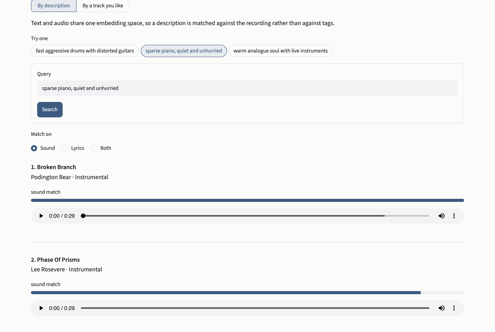
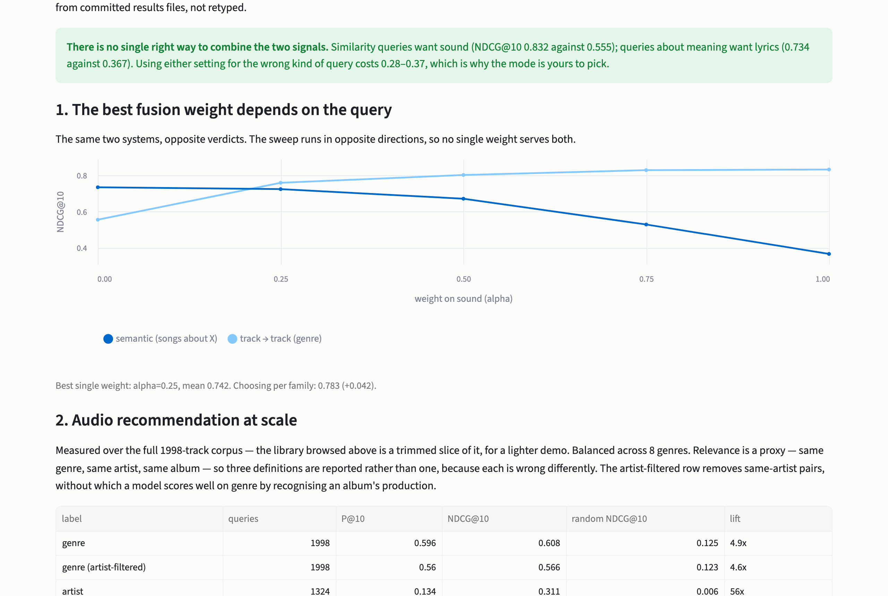

# aux

[](https://github.com/hgn2108/aux/actions/workflows/tests.yml)
[](pyproject.toml)
[](LICENSE)

**A Spotify-style recommender for the music you already own.**

Streaming services recommend well because they watch millions of listeners. If your music
sits in a folder on your laptop, none of that applies: local players search filenames and
genre tags, and nothing lets you ask for *"something quiet and bittersweet"* or *"like this,
but dreamier"*.

`aux` builds that recommender from the audio itself — no tags, no play counts, no listening
history.

**Live demo:** https://aux-339224224982.us-central1.run.app — the first search takes about a
minute while the model loads.



---

## How it works


Two independent signals, searched the same way:

- **Sound** — [MuQ-MuLan](https://huggingface.co/OpenMuQ/MuQ-MuLan-large) puts music and text
  in one embedding space, so a written description can be matched against a recording
  directly. Chosen over the main alternative, CLAP, after both were measured on this corpus
  and the difference was tested for significance.
- **Lyrics** — Whisper transcribes the track, Qwen3 embeds the words.

A slider blends the two. Which setting is right turns out to depend on the question, which is
the main finding below.

## Run it

```bash
git clone https://github.com/hgn2108/aux && cd aux
pip install -e ".[app]"
streamlit run app.py
```

Point it at your own folder by dropping files into `data/music/`, or use the **Your music**
tab to upload them straight into the browser.

---

## Results

Whether two tracks "sound similar" is a matter of opinion, so the system is not graded on
that. It is graded on facts: two tracks count as a match if they share a genre, an artist or
an album. None of those *is* musical similarity, so all three are reported, because each is
wrong in a different way.

Every score below is **NDCG@10** — of the ten tracks returned, how many were matches, and
were the matches near the top. 1.0 is perfect. Each is shown next to the score a random
shuffle gets on the same labels, so the number has a floor to be read against.

### Recommending from sound alone

Given a track, about 6 of the 10 returned share its genre, against about 1 of 10 by chance.
Artist is a far harder target, and it does 56× better than chance there.

| relevance label | queries | NDCG@10 | random | lift |
|---|---:|---:|---:|---:|
| genre | 1,998 | 0.608 | 0.125 | **4.9×** |
| genre, same-artist pairs excluded | 1,998 | 0.566 | 0.123 | **4.6×** |
| artist | 1,324 | 0.311 | 0.006 | **56×** |
| album | 1,193 | 0.287 | 0.003 | **88×** |

Row two is a control: tracks from one album share production and mastering, so a system can
score on *genre* by recognising an *album* instead. Removing same-artist pairs costs 0.04, so
the genre result is not that effect in disguise.

### The right blend depends on the question

The same two systems, the same music, opposite answers — decided only by what was asked.

| α (weight on sound) | *"tracks like this one"* | *"songs about heartbreak"* |
|---:|---:|---:|
| 0.00 — lyrics only | 0.555 | **0.734** |
| 0.50 | 0.802 | 0.671 |
| 1.00 — sound only | **0.832** | 0.367 |

Genre and artist are audible, so lyrics add nothing when matching on those. Ask what a song
is *about* and the lyrics score twice what sound does, winning 8 of the 9 subjects tested.
The one exception is *heartbreak*, where sound wins: sad songs sound sad.

Set the weight wrong for the question being asked and the system loses **a third to a half**
of its accuracy. No single setting is right for both.

### Setting that weight automatically did not work

If the right weight depends on the question, the obvious next step is to detect the question
and set the weight for the user. Three ways of doing that were tried: matching keywords,
comparing the query to example queries, and asking an LLM.

| approach | NDCG@10 | speed |
|---|---:|---:|
| fixed weight, no detection | 0.552 | instant |
| keyword matching | 0.500 | instant |
| compare to example queries | 0.570 | 2 ms |
| ask an LLM | 0.571 | 1.7 s |
| *perfect detection (upper bound)* | *0.670* | — |

The last row is the score if every question were classified correctly, so it is the most any
method of this kind could be worth. None of the three got close, and none beat simply fixing
the weight by enough to be statistically significant over 96 queries.

**The app therefore exposes the weight as a control rather than guessing it.** Someone
searching already knows whether they are asking about sound or about meaning.

Keyword matching looked like the winner until the test set changed. Its rules and the test
queries had been written by the same person, so it was rewarded for recognising familiar
phrasing. Retested on differently worded queries meaning the same things, it went from the
best of the three to the worst.



Full tables, ablations and significance tests: **[EVALUATION.md](EVALUATION.md)**.

---

## What's next

The system ranks purely on what a track sounds like and what its words say. It does not yet
learn from the person using it. Three planned stages, in order:

1. **Learn from plays.** Results play inside the app, so each play, skip or replay can be
   recorded against the query and position that produced it. That produces preference data
   from ordinary use, without needing anyone's streaming account.
2. **Keep preference specific to the request.** The result above shows that what counts as a
   good match changes with the question. Taste likely behaves the same way, so what is
   learned from *"music for running"* should not change results for *"music for studying"*.
3. **Balance familiarity against discovery.** Ranking on similarity alone tends to return
   more of what a listener already knows. Measuring that trade-off only becomes possible once
   there is preference data to measure it against, which is why it comes last.

---

## Limitations

- **Relevance labels are proxies.** Genre, artist and album are not musical similarity. They
  are used because they are objective and complete, and reported together because they fail
  differently.
- **The lyric results use a separate 160-track collection.** No public corpus available here has
  a usable lyric channel: 56% of a sampled 75 Free Music Archive clips are instrumental, with
  transcripts running a median of 11 words.
- **The "songs about X" labels were generated by a model**, then checked against blind human
  judgement on a sample. Agreement was substantial but not perfect. Dropping the two themes
  where agreement was weakest narrows the lyric lead from 0.734 to 0.717 against 0.430, so
  the conclusion holds without them.
- **The router comparison uses 96 queries.** It rules out large effects, not small ones.
- **The blend weight is set by hand, and search compares against every track.** At this
  corpus size comparing everything is instant, so an approximate index would add complexity
  for no gain. A learned blend was not attempted because it would have to be trained on the
  same imperfect labels described above.

## Layout

| path | what |
|---|---|
| `app.py` | the demo |
| `src/aux/ingest/` | probe, decode, content hashing, failure taxonomy |
| `src/aux/encode/` | encoder adapters, segmentation, pooling |
| `src/aux/lyrics/` | transcription and lyric embedding |
| `src/aux/recommend.py` | scoring, blending, explanations |
| `src/aux/route/` | the three fusion-weight routers |
| `src/aux/eval/` | ranking metrics, paired significance tests |
| `scripts/` | every experiment, one file each |
| `results/` | committed JSON behind every number above |

## Licence

MIT, for the code. The model weights downloaded at runtime carry their own licences
(MuQ-MuLan is CC-BY-NC). No music is distributed here — see [LICENSE](LICENSE).
