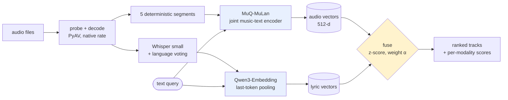

# aux

**A multimodal music recommender, and an evaluation that says when to trust it.**

Recommend tracks by how they *sound*, by what their lyrics are *about*, or by both — over
audio files on disk, with no metadata, no play counts and no labels.

The interesting part is not the recommender. It is the measurement: fusing the two signals
**loses** on the task everybody benchmarks, and **wins by 2×** on the task nobody does. This
repository is mostly the work of establishing which is which.

```bash
pip install -e ".[app]"
streamlit run app.py
```

---

## Results

### Audio recommendation at scale — 1,998 tracks, 8 genres

Relevance is a proxy: two tracks are "relevant" when they share a genre, an artist or an
album. None of those is musical similarity, so three are reported rather than one, because
each is wrong in a different direction.

| relevance label | queries | P@10 | NDCG@10 | random NDCG@10 | lift |
|---|---:|---:|---:|---:|---:|
| genre | 1,998 | 0.596 | 0.608 | 0.125 | **4.9×** |
| genre, same-artist pairs excluded | 1,998 | 0.560 | 0.566 | 0.123 | **4.6×** |
| artist | 1,324 | 0.134 | 0.311 | 0.006 | **52×** |
| album | 1,193 | 0.074 | 0.287 | 0.003 | **95×** |

The second row is the one that matters. Tracks from one album share production, mastering and
instrumentation, so a model can score well on *genre* by recognising an *album*. Excluding
same-artist pairs costs only 0.04 P@10 — the genre result is not the album effect in
disguise. And artist/album at 52–95× random show the embedding captures something far finer
than genre.

### The best fusion weight depends on the query

The same two systems, the same corpus, opposite verdicts. `α` is the weight on sound.

| α | track → track (genre) | "songs about X" |
|---:|---:|---:|
| 0.00 — lyrics only | 0.555 | **0.734** |
| 0.25 | 0.759 | 0.724 |
| 0.50 | 0.802 | 0.671 |
| 0.75 | 0.829 | 0.529 |
| 1.00 — sound only | **0.832** | 0.367 |

NDCG@10. The sweep runs in **opposite directions**.

Fusion "failing" was never a fact about the modalities — it was a fact about the task. Genre,
artist and album are all things you can *hear*, so the lyric channel has nothing independent
to contribute. Ask instead what a song is *about* and the lyric channel doubles the audio
one, winning 8 of 9 themes. The single exception is *heartbreak*, where sound wins: sad songs
sound sad.

Applying either family's best weight to the other costs **0.28–0.37 NDCG@10**. There is no
correct fixed weight.

### Routing: the decision is worth making, the routers aren't

If the weight should change per query, something must choose it. Three routers, scored end to
end against an oracle allowed to see the answers — an upper bound on any router.

| router | NDCG@10 | vs best fixed | % of oracle gap | ms/query |
|---|---:|---:|---:|---:|
| keyword rules | 0.500 | −0.053 | −45% | 0.0 |
| embedding prototypes | 0.570 | +0.017 | 15% | 2.3 |
| LLM (Haiku) | 0.571 | +0.019 | 16% | 1686 |
| *best fixed weight* | *0.552* | — | *0%* | *0.0* |
| *oracle (upper bound)* | *0.670* | — | *100%* | — |

**None beats a fixed weight significantly** (n=96, paired permutation, Bonferroni threshold
0.0125). Choosing one weight per query *family* does: **+0.051 NDCG@10, p=0.0001**.

So the decision is real and no router I built can make it. The app therefore ships a **mode
selector** — the person searching already knows whether they are asking about sound or
meaning, and the evidence does not support guessing for them. The LLM was built, measured,
and left out.

### The result I nearly published

On 24 hand-written queries the keyword router **led**, at +0.058. I regenerated the query set
with paraphrases instructed to avoid the constructions the rules key on — deliberately
biasing *against* the router I expected to win.

It went from **+0.058 to −0.053**. Best arm to worst, on held-out phrasing alone.

It had been fitted to queries written by the same person who wrote the rules. Same corpus,
same labels, same code.

---

## How it works



**Sound.** [MuQ-MuLan](https://huggingface.co/OpenMuQ/MuQ-MuLan-large) embeds music and text
into one space, so a description can be matched against a recording directly. Chosen over
CLAP by a paired test on this corpus (p=4.5e-08). Each track is five deterministic windows,
L2-normalised, averaged, re-normalised.

**Lyrics.** Whisper transcribes; language detection votes across five windows, which fixed
Vietnamese tracks being silently translated to English (3/5 → 13/13 correct). Qwen3-Embedding
encodes the transcript with last-token pooling.

**Fusion.** Scores are z-score normalised per query before blending, so `α` means what it
says. Min-max was measured first and lost at every interior weight — its range is set by the
two most extreme candidates, so one outlier rescales everything. A track with no transcript
keeps its audio score rather than being zeroed, which would quietly turn fusion into a
vocal-music filter.

**Caching.** Embeddings are keyed by `(content hash, encoder version, segment count)`, so
re-indexing is free and a changed encoder invalidates exactly what it should.

---

## Running it

```bash
pip install -e ".[dev,app]"
pytest                                          # 241 tests

python scripts/eval_recommendation.py --corpus fma --per-genre 250
python scripts/eval_semantic.py
python scripts/eval_router.py
python scripts/eval_routing.py                  # the crossover table
streamlit run app.py
```

Results are written to `results/*.json` and the app reads them from there, so no number in
the demo can drift from the run that produced it.

---

## Honest limitations

- **Relevance labels are proxies.** Genre, artist and album are not musical similarity. They
  are used because they are objective and complete, and reported together because they fail
  differently.
- **The multimodal results use a 160-track personal library.** No public corpus available
  here has a usable lyric channel: 56% of a sampled 75 FMA clips are instrumental, with
  transcripts running a median of 11 words. Creative Commons catalogues skew heavily
  instrumental, which is why published multimodal music work tends to rely on commercial
  ones. That library is not redistributable, so its audio is never served and its tracks are
  shown under stable pseudonyms.
- **Theme labels are model-generated**, validated against blind human judgement at Cohen's
  **κ = 0.60**. Two themes fell below that bar; dropping them narrows the lyric lead from
  0.734 to 0.717 against sound's 0.430 and does not change the conclusion.
- **The router comparison uses 96 queries.** It rules out large effects, not small ones.
- **No learned fusion, no ANN index, no personalisation.** At this corpus size an exact
  search is instant, and a learned combiner would be fitted on the same proxy labels whose
  weakness is the point.

## Layout

| path | what |
|---|---|
| `src/aux/ingest/` | probe, decode, content hashing, failure taxonomy |
| `src/aux/encode/` | encoder adapters, segmentation, pooling |
| `src/aux/lyrics/` | transcription and lyric embedding |
| `src/aux/recommend.py` | scoring, fusion, explanations |
| `src/aux/route/` | the three fusion-weight routers |
| `src/aux/eval/` | ranking metrics, paired significance tests |
| `scripts/` | every experiment, one file each |
| `results/` | committed JSON behind every number above |
